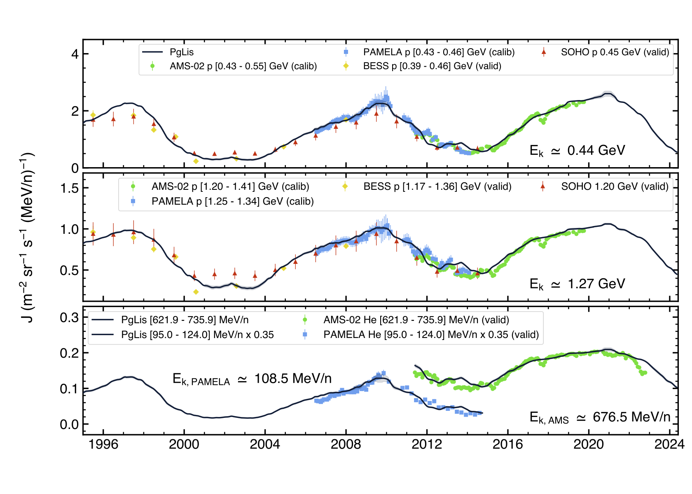

# The PgLis model

__PgLis__ is a model developed to forecast the flux of solar-modulated galactic cosmic-rays near Earth.

We modelled the different transport parameters that cosmic rays experience as they traverse the heliosphere to arrive at Earth (__article link available soon__), parametrised them as functions of solar activity, using the widely available sunspot number as a proxy (see [NOAA](https://www.swpc.noaa.gov/products/solar-cycle-progression)), which we delay according to [Tomassetti et al. (2022)](https://doi.org/10.1103/PhysRevD.106.103022) to account for transport time.

This allows us to estimate the fluxes of cosmic nuclei near Earth, from Hydrogen to Nickel, as they evolve with solar activity.

<p align="center">

</p>

This package is a Python implementation that interpolated between the pre-computed tables available in [Zenodo](https://doi.org/10.5281/zenodo.19607311).
It downloads the data from [Zenodo](https://doi.org/10.5281/zenodo.19607311) and the sunspot numbers from [NOAA](https://www.swpc.noaa.gov/products/solar-cycle-progression).


## Background

The modulation of galactic cosmic rays, driven by the evolution of the heliospheric magnetic field, strongly influences the intensity of cosmic rays reaching near-Earth space. Characterizing this process is crucial both for advancing our understanding of cosmic ray transport and for assessing radiation exposure and related hazards in space environments.

Here we present the __PgLis__ model, a newly developed forecasting framework built upon our previous work, designed for the long-term forecasting of galactic cosmic-ray fluxes.

The model is the result of a collaboration between the _Università degli Studi di Perugia_ (Pg) and the _Laboratório de Instrumentação e Física Experimental de Partículas_ in Lisbon (Lis), and is based on a numerical description of charged-particle transport in the heliosphere and its dependence on solar activity.

The __PgLis__ model has been validated using multi-species flux measurements from space-based instruments such as PAMELA, AMS-02, and ACE. Its strategy is based upon Hilbert-Huang transform filtering and cross-correlation between delayed solar proxies and effective model parameters.

It demonstrates a demonstrably good performance across a broad multichannel and multi-species testing dataset, spanning different energy ranges and solar phases. These advancements enhance its applicability to space radiation monitoring and forecasting. Furthermore, when coupled with solar-proxy forecasting models, PgLis enables decadal-scale predictions of galactic cosmic-ray fluxes, thereby supporting long-term planning and radiation-risk assessment for future space missions.

# Usage examples

More examples can be found in [examples.ipynb](examples.ipynb).

## Getting the flux for a given time
```python3
# setup model
model = pglis.solar_mod()

# defining the time - 2001/06/01
t = datetime.datetime(2001, 6, 1).timestamp()

# getting the flux as a dataframe
df = model.get_dataframe_flux_vs_energy(Z=1, time=t)
```

# Authors

David Pelosi<sup>1,2</sup>, Fernando Barão<sup>3,4</sup>, Bruna Bertucci<sup>1,2</sup>, Emanuele Fiandrini<sup>1,2</sup>, Miguel Orcinha<sup>2</sup> and Nicola Tomassetti<sup>1,2</sup>

<sup>1</sup> Università degli Studi di Perugia, Perugia 06100, Italy <br>
<sup>2</sup> INFN - Perugia, Perugia 06100, Italy <br>
<sup>3</sup> Laboratório de Instrumentação e Física Experimental de Partículas, Lisboa 1000, Portugal <br>
<sup>4</sup> Instituto Superior Técnico, Lisboa 1049, Portugal <br>

<p align="center">

</p>

## Maintainers

David Pelosi<sup>1,2</sup> [E-mail](mailto:david.pelosi@pg.infn.it) <br>
Miguel Orcinha<sup>2</sup> [E-mail](mailto:orcinha@pg.infn.it)

# How to cite

__Pelosi et al. (2026) The PgLis Model: A Tool for Long-Term Galactic Cosmic Ray Forecasting, Phys. Rev. D, (under review)__

This package was created to simplify and systematise the access to the flux model presented in the article _Pelosi et al. (2026) The PgLis Model: A Tool for Long-Term Galactic Cosmic Ray Forecasting, Phys. Rev. D, (under review)_.

The heatmaps with the discretised model used in this package can be found in [Zenodo](https://zenodo.org/records/19971913).

# Acknowledgements

This work as been developped with support from ASI, under ASI-UniPG 2019-2-HH.0, ASI-INFN 2019-19 HH.0, its amendment 2021-43 HH.0, the Italian Ministry of University and Research (MUR) through the program "Dipartimenti di Eccellenza 2023-2027" and FCT under grant 2024.00992.CERN, Portugal.
